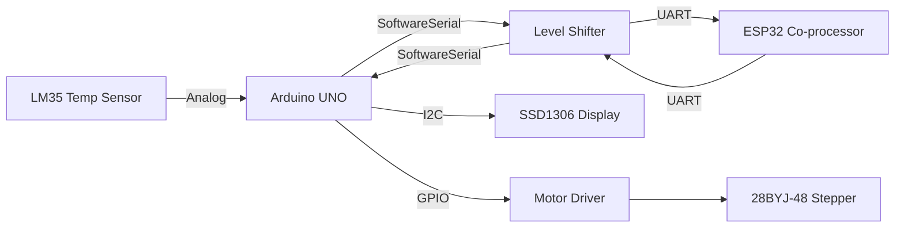

# SAGE Edge AI Motor Controller

A dual-microcontroller embedded system demonstrating real-time, data-driven machine control. By relying on a lightweight Edge AI polynomial model deployed onto an ESP32, this project achieves intelligent, dynamic stepper motor speed modulation purely from temperature variances recorded by an Arduino UNO.

## 🌟 Features
- **Split Processing Architecture:** Utilizes the Arduino UNO strictly for I/O bounds and real-time states, while offloading all computational Machine Learning inference to the ESP32.
- **Edge AI Inference:** Eschews rigid rule-based tables (`map()`) in favor of an onboard, continuous 3rd-Degree Polynomial Regression equation running natively on the ESP32's hardware FPU.
- **Robust DSP:** Incorporates iterative ADC over-sampling on the UNO paired with Exponentially Weighted Moving Averages (EWMA) to smooth thermal measurements perfectly.
- **SRAM-Optimized Visualization:** Implements a professional OLED Embedded Dashboard using `PROGMEM` string allocations to prevent SRAM exhaustion on the 8-bit AVR architecture.
- **Jitter-Free Control:** Integrates asynchronous, non-blocking `millis()` polling methods across UART and stepper sequences to prevent execution stutter.

---

## 🏗 System Architecture



## 🔌 Hardware Stack
*   **Microcontrollers:** Arduino UNO (ATmega328P), ESP32-WROOM-32
*   **Sensors:** LM35 Linear Temperature Sensor
*   **Actuators:** 28BYJ-48 Stepper Motor + ULN2003 Driver Board
*   **Display:** 0.96" I2C SSD1306 OLED (128x64)
*   **Other:** Bi-directional Logic Level Converter (5V ↔ 3.3V)

## 💻 Software Stack
*   **Environment:** PlatformIO (C++)
*   **Libraries:** `Adafruit SSD1306`, `Adafruit GFX Library`, `SoftwareSerial`, `Wire`
*   **Data Science Pipeline:** Python (`pandas`, `scikit-learn`, `matplotlib`)

---

## 📂 Project Structure

```text
├── SAGE          # Arduino UNO Codebase (Hardware Layer)
│   ├── src/
│   │   ├── main.cpp       # Main non-blocking orchestration loop
│   │   ├── adc.cpp/h      # Averaging analog reader 
│   │   ├── stepper.cpp/h  # Non-blocking sequence stepper driver
│   │   ├── uart.cpp/h     # Custom half-duplex serial handler
│   │   └── oled_gui.cpp/h # PROGMEM-optimized Adafruit GFX dashboard
│   └── platformio.ini         
└── Esp32         # ESP32 Codebase (Inference Layer)
    ├── src/
    │   └── main.cpp       # EWMA smoothing & 3rd-degree regression logic
    ├── ML_Model/          # Machine learning pipeline scripts & datasets
    └── platformio.ini
```

---

## 🚀 How to Run

1. Clone this repository locally.
2. Open the enclosing workspace in **VS Code** with the **PlatformIO** extension installed.
3. Flash the Arduino logic:
   - Navigate to the `SAGE` folder via the PlatformIO project selector.
   - Attach your Arduino UNO and click `Upload`.
4. Flash the ESP32 intelligence:
   - Navigate to the `Esp32` folder.
   - Swap ports, put the ESP32 in boot mode, and click `Upload`.
5. Reset both microcontrollers and monitor the OLED dashboard.

## 📊 Technical Results
The transition from an archaic rule-based `switch/case/map` approach to a regression model allows the physical cooling loop to operate more efficiently. The polynomial equation dynamically captures the natural "bell curve" thermal dissipation sweet spot identified in the original data collection, providing smooth fan acceleration where needed while tapering quickly to conserve power.


## 🔮 Future Improvements
*   **I2C Coprocessor Link:** Migrate the inter-board cross-talk from Software UART to an I2C Slave/Master setup to entirely eradicate interrupt overhead on the UNO.
*   **Hardware Timer Stepping:** Shift the stepper coil excitation into a native AVR Hardware Timer (`Timer1` or `Timer2`) routine to completely decouple physical motor movement from background CPU jitter.
*   **Predictive Maintenance:** Utilize the secondary ESP32 core to ingest the acoustic/vibration profile of the stepper, feeding it into a lightweight Neural Network (`TensorFlow Lite Micro`) to detect impending bearing failure.
