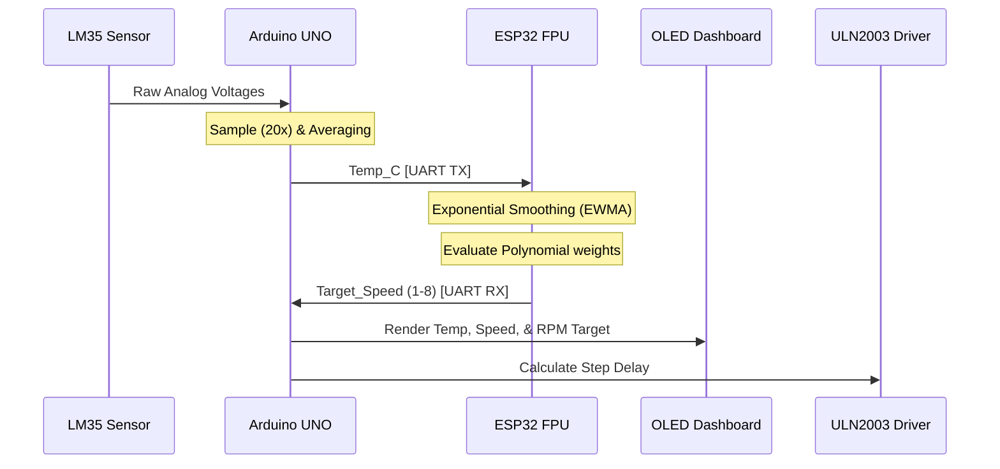

# Technical Documentation

## 1. Problem Statement & Objective
Traditional embedded thermal-regulation loops rely heavily on rigidly predefined thresholds, preventing systems from adapting efficiently to complex heat accumulation profiles. The objective of this project is to construct a scalable Edge AI demonstration platform. The system acquires thermal telemetry via a primary control unit, securely transmits it to an AI coprocessor, runs inferences against a mathematically established polynomial regression curve, and executes the physical responses—all while maintaining predictable, real-time deterministic performance.

## 2. Working Principle & Data Flow

As detailed in the timeline below, the system hinges on a highly asynchronous loop wherein time-critical tasks do not block telemetry pipelines.



## 3. Data Collection & Modeling Strategy

Initially, physical logs recording the relationships between local temperature and required system fan states were compiled. 

### Why Polynomial Instead of Linear Mapping?
Traditional `map()` constraints force a linear response (e.g., $y = mx + b$). However, the collected real-world data identified a localized efficiency peak (a bell-curve acceleration profile). By employing a **3rd-degree Polynomial Regression Model**, the system elegantly bounds the physical response mathematically without using nested `if-else` tables.

```mermaid
graph TD
    A[Raw Hardware Logs] --> B[Drop Duplication & Noise]
    B --> C[Poly Regression (Degree: 3) via Scikit-Learn]
    C --> D["Speed = a*T^3 + b*T^2 + c*T + d"]
    D --> E[Weight Extraction]
    E --> F[Inference via Float Math on ESP32]
```

## 4. Edge Deployment Strategy
Instead of implementing an invasive embedded framework like TensorFlow Lite Micro—which carries immense computational overhead for simple scalar outputs—the model was simplified manually into its constituent arithmetic sequence. By floating the 4 unique weights into the ESP32 code, the ESP32 acts as a high-speed matrix calculator.

**Algorithm execution footprint:** 2 lines of C++, 0 bytes of dynamic memory allocation.

## 5. Challenges Faced & Solutions

### A. Communication Interrupt Contention
**Challenge:** Arduino's `SoftwareSerial` library manages UART via bit-banging and highly sensitive Pin Change Interrupts (PCINT). Since the UNO operates in half-duplex mode, any rapid response from the ultra-fast 240MHz ESP32 was inherently lost.
**Solution:** Artificially retarded the ESP32's dispatch routine (`delay(50)`) immediately after reading the incoming UNO packet. This ensures the UNO's UART transmit block has cleanly restored global interrupts and is available in input mode before the ESP32 speaks.

### B. UI Rendering Attrition (SRAM Famine)
**Challenge:** Adafruit's SSD1306 buffer intrinsically monopolizes 1024 bytes (50%) of the UNO's entire RAM. Dynamically updating screens caused sporadic stack overflows.
**Solution:** Embedded rendering rules ensuring total encapsulation of character primitives into non-volatile Flash memory (`PROGMEM`/`F()`). 

### C. Half-Duplex Logic Sinking
**Challenge:** The ESP32 is a 3.3V logic circuit while the ATmega328P demands 5V. 
**Solution:** Hardware integration of a bi-directional Logic Level Converter ensures no destructive voltage backfeed while maintaining pulse integrity at 4800 baud. 

```mermaid
graph TD
    subgraph Arduino UNO (5V Logic)
        D5[Pin 5 - Software TX]
        D6[Pin 6 - Software RX]
    end
    
    subgraph Level Converter
        HV[HV Side 5V]
        LV[LV Side 3.3V]
    end
    
    subgraph ESP32 (3.3V Logic)
        R16[GPIO 16 - HW RX2]
        T17[GPIO 17 - HW TX2]
    end

    D5 --- HV_TX[HV In]
    HV_TX -.-> LV_TX[LV Out]
    LV_TX --- R16

    T17 --- LV_RX[LV In]
    LV_RX -.-> HV_RX[HV Out]
    HV_RX --- D6
```
